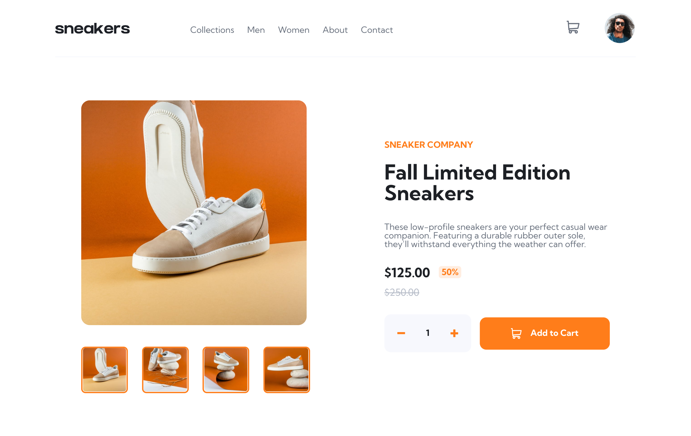
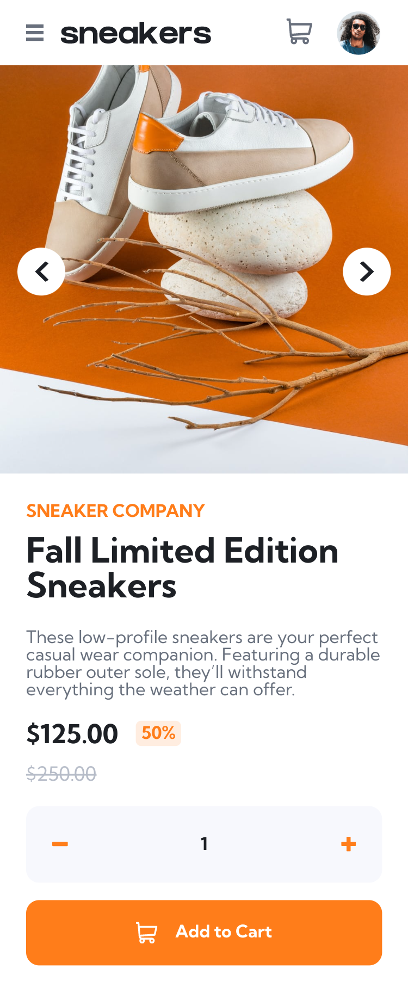

# Frontend Mentor - E-commerce product page solution

This is a solution to the [E-commerce product page challenge on Frontend Mentor](https://www.frontendmentor.io/challenges/ecommerce-product-page-UPsZ9MJp6). Frontend Mentor challenges help you improve your coding skills by building realistic projects.

## Table of contents

- [Overview](#overview)
  - [The challenge](#the-challenge)
  - [Screenshot](#screenshot)
  - [Links](#links)
- [My process](#my-process)
  - [Built with](#built-with)
  - [What I learned](#what-i-learned)
- [Author](#author)

## Overview

### The challenge

Users should be able to:

- View the optimal layout for the site depending on their device's screen size
- See hover states for all interactive elements on the page
- Open a lightbox gallery by clicking on the large product image
- Switch the large product image by clicking on the small thumbnail images
- Add items to the cart
- View the cart and remove items from it

### Screenshot

#### Desktop

#### Mobile

### Links

- Solution URL: [Add solution URL here](https://your-solution-url.com)
- Live Site URL: [HERE](https://ecommerce.raelcode.tech)

## My process

### Built with

- HTML
- Sass framework for CSS
- Vite for bundling
- [Vue](https://vuejs.org/) - JS Framework
- [Pinia](https://pinia.vuejs.org/) - For State Management

### What I learned

My main takeaways from this project are:

- Vue State Management using Pinia
- CSS enhancement using Sass

## Author

- Frontend Mentor - [@kibzrael](https://www.frontendmentor.io/profile/kibzrael)
- Twitter - [@kibzrael](https://www.twitter.com/kibzrael)
